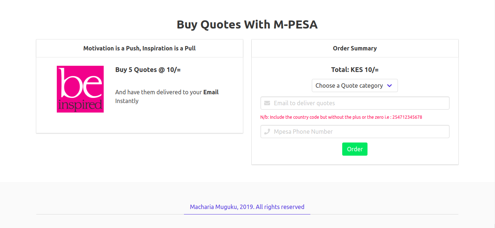
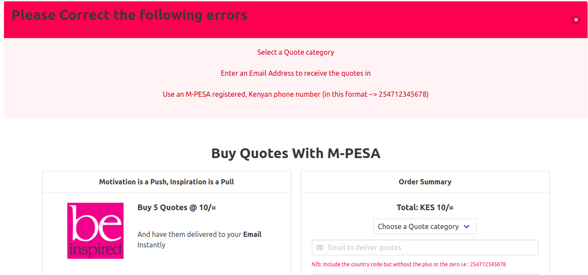
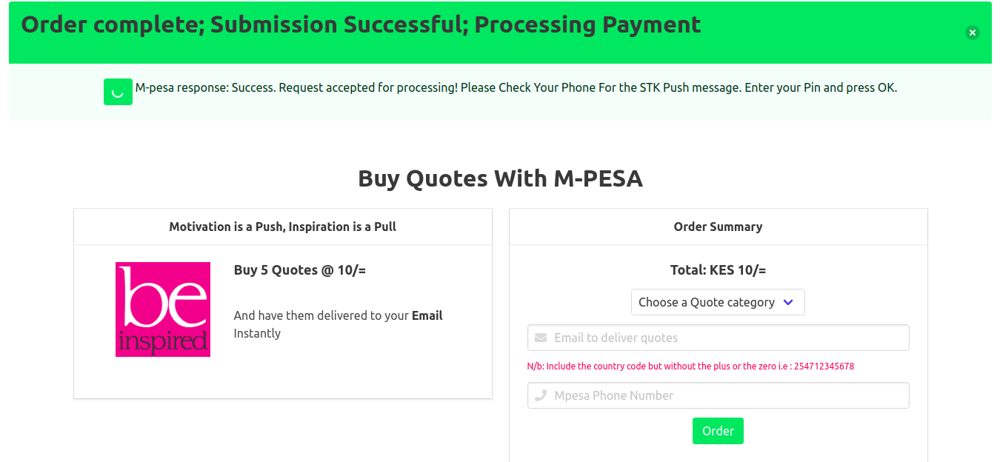

# Buy Quotes With M-Pesa

BuyQuotes is a Nodejs app that enables you to buy quotes online using [lipa na MPESA](https://www.safaricom.co.ke/personal/m-pesa/lipa-na-m-pesa/what-is-lipa-na-m-pesa) on your phone and have them delivered to your email instantly.

## Tech Stack

Nodejs, Express, Handlebars, MongoDB, mongoose, nodemailer, etc..

## Installation

Git clone this repo to your local machine and cd to that folder.

```bash
git clone https://github.com/machariamuguku/BuyQuotes.git && cd BuyQuotes
```

Open the project in your favorite text editor e.g [Visual Studio Code](https://code.visualstudio.com/)

```vs
code .
```

Create a [safaricom developers account](https://developer.safaricom.co.ke/) and head over to [the test credentials page](https://developer.safaricom.co.ke/test_credentials) to get your test credentials. Fill in these test credentials in the router.js file.

Head over to [MongoDB Atlas](https://cloud.mongodb.com) and create a free account. select a cluster and copy the connection url to the mongoDBconnector.js file. Follow the password instructions on the file's inline comments.

Follow the instructions [Here](https://medium.com/@nickroach_50526/sending-emails-with-node-js-using-smtp-gmail-and-oauth2-316fe9c790a1) to generate gmail's SMTP OAuth2 authentication tokens to be able to use nodemailer. Fill in these credentials in the sendemail.js file.

Use the [npm](https://www.npmjs.com/) package manager to install all dependencies.

```npm
npm i
```

Go to [Heroku](https://www.heroku.com/) and create an account. Follow instructions there and install heroku cli. Git commit your project and push to heroku.

```git
git push heroku master
```

## Usage



- Go to [The site url](https://buyquotes.herokuapp.com/).
- Select a quote category from the drop down.
- Enter your email address.
- Enter a valid, M-Pesa registered, Kenyan phone number in the following format

```
254712345678
```

- Press the Order button.
  
- If no errors, an stk push message is sent to your phone with preset payment options.
- Enter your M-PESA pin and press OK.
  
- If everything is successful, after two minutes, your quotes will be delivered to your email inbox.

## Contributing

Pull requests are welcome. For major changes, please open an issue first to discuss what you would like to change.

Please make sure to update tests as appropriate.

## License

[GNU - gpl-3.0](https://choosealicense.com/licenses/gpl-3.0/)
