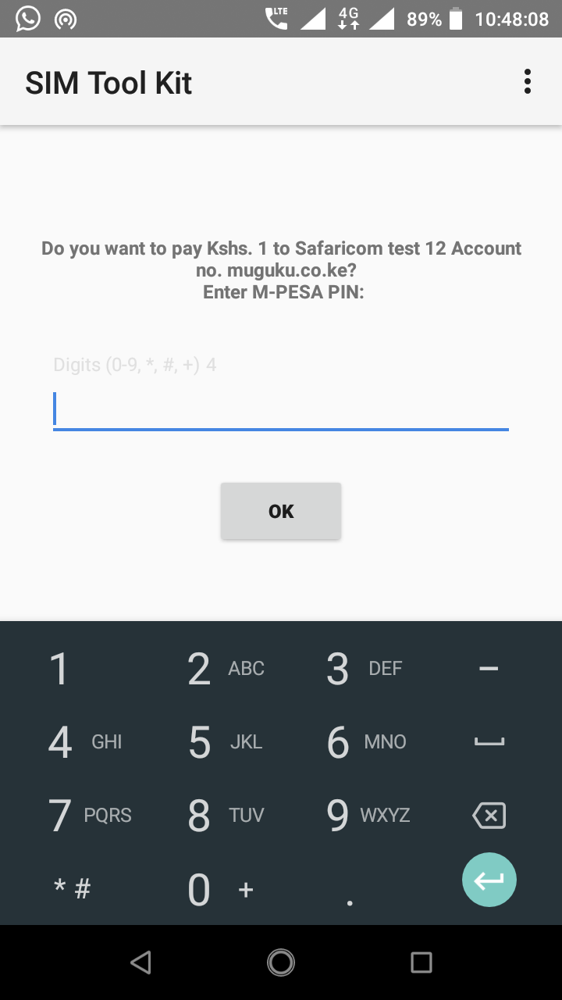
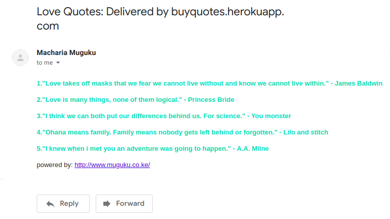
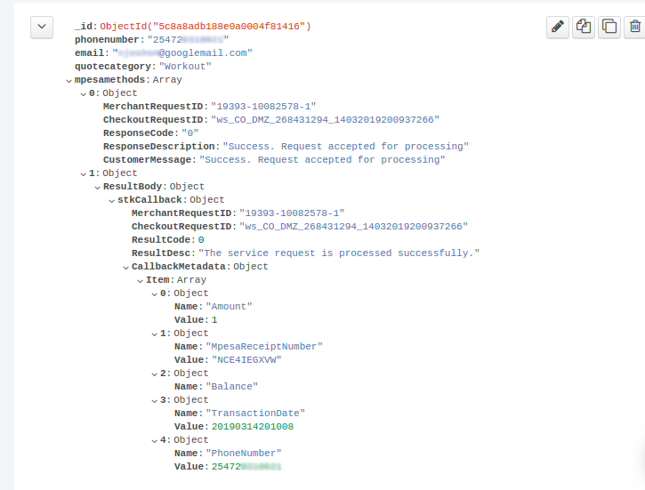

# Buy Quotes With M-Pesa

BuyQuotes is a Nodejs eCommerce app that enables you to buy quotes [online](https://buyquotes.herokuapp.com) using [MPESA](https://en.wikipedia.org/wiki/M-Pesa) on your phone and have them delivered to your email.

## Demo Site

[buyquotes.herokuapp.com](https://buyquotes.herokuapp.com)

## Tech Stack

Nodejs, Express, Handlebars, Bulma, MongoDB, Nodemailer, Other [npm](https://www.npmjs.com/) packages

## Installation

Git clone this repo to your local machine and cd to that folder.

```bash
git clone https://github.com/machariamuguku/BuyQuotes.git && cd BuyQuotes
```

Open the project in your favorite text editor e.g [Visual Studio Code](https://code.visualstudio.com/)

```vs
code .
```

Create a [safaricom developers account](https://developer.safaricom.co.ke/) and get your test credentials at [the test credentials page](https://developer.safaricom.co.ke/test_credentials). Fill in these test credentials in the router.js file.

Create a free account at [MongoDB Atlas](https://cloud.mongodb.com). Select a cluster and copy the connection url to the mongoDBconnector.js file. Follow the password instructions in the file's inline comments.

Follow the instructions [Here](https://medium.com/@nickroach_50526/sending-emails-with-node-js-using-smtp-gmail-and-oauth2-316fe9c790a1) to generate gmail's SMTP OAuth2 authentication tokens to be used by nodemailer. Fill in these credentials in the sendemail.js file.

**N/b:** You can use gmail's plain username and password but this will trigger constant security warnings and possibly block the connections if they are sent from a different jurisdiction.

Use the [npm](https://www.npmjs.com/) package manager to install all dependencies listed in the package.json file.

```npm
npm i
```

create an account on [Heroku](https://www.heroku.com/), install heroku cli, git commit your project and push to heroku.

```git
git push heroku master
```

## Usage

- Go to [The site url](https://buyquotes.herokuapp.com/).

- Select a quote category from the drop down.
- Enter your email address.
- Enter a valid, M-Pesa registered, Kenyan phone number in the following format

> 254712345678

- Press the Order button.
- If no errors, a success message is rendered to the site
 
- And an stk push message is sent to your phone with preset payment options.
 
- Enter your M-PESA pin and press OK.

- If everything is successful, after two minutes, your quotes are delivered to your email inbox.

## Screenshots

1. Successful Email Sent
 

2. Error handling


3. MongoDB Atlas Document entry
 

## Contributing

Pull requests are welcome. For major changes, please open an issue first to discuss what you would like to change.

Please make sure to update tests as appropriate.

## License

[GNU - gpl-3.0](https://choosealicense.com/licenses/gpl-3.0/)